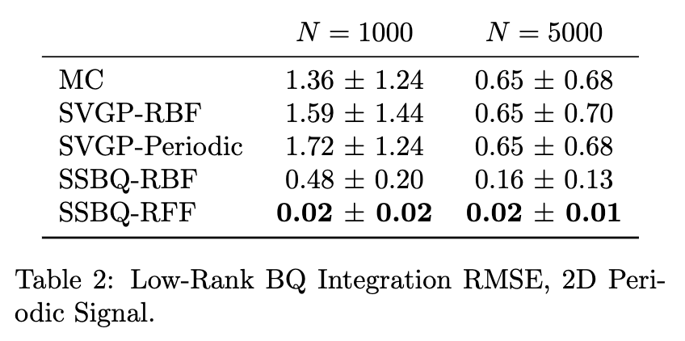

# FFBQ Full Experimental Results

## 1. 2D Gaussian Ablation Study

We measure here the ability for kernel mean approximators to capture the true analytical BQ solutions provided by a Gaussian kernel/measure pair (the traditional BQ setup). In this setting, we are looking to measure how effectively FFBQ and SSBQ can recreate results from known BQ solutions.

### 1.1 Kernel Mean, Integral Mean, Integral Variance Approximation Error to Gaussian BQ

### 1.2 Kernel Mean, Integral Mean, Integral Variance Approximation Error to Gaussian BQ: Computation Time and Accuracy

## 2. Genz Integration Benchmarks
*The following text has been adapted from the full paper.*

Next, we evaluate the performance of FFBQ and SSBQ, using an expanded set of kernel families that are not analytically tractable in traditional BQ, on a variety of $d$-dimensional Genz bounded integration benchmarks. Specifically, we adopt the Genz continuous, discontinuous, and oscillatory benchmarks to study FFBQ and SSBQ's integration capability across varied integrand geometries. 

For MC, QMC, FFBQ, and SSBQ, we implement the RBF, the Matern 3/2, and fully parametric RFF kernels. For SSBQ, we report results for the QMC variant in Equation 21 of the paper. We evaluate all possible combinations of kernel families and kernel mean operators; however, some combinations are restricted (such as using non-analytical kernel/measure combinations within vanilla BQ). 

Importantly, all these experiments are carried out under strictly controlled conditions, with identical hyperparameters, data sizes ($N = 1000$, $R=100$), learning rates, training epoch counts, and diagonal Gram matrix noise to ensure a fair comparison. The efficacy of the Bayesian quadrature scheme is well-supported, and the intention in this study is not to focus on magnitude of error -- which can be strongly dependent on these factors -- but rather the relative errors between methods under identical circumstances.

## 3. Low-Rank Integration
*The following text has been adapted from the full paper.*

Lastly, we perform an ablation study of SSBQ against an alternative low-rank GP methodology in Nystr\"om approximation. Specifically, we adapt the sparse variational GP (SVGP) approach, in which $R$ GP inducing point locations are trained through variational inference and subsequently used for low-rank inference. We use a problem setting of integration over a 2D periodic signal.

We use QMC kernel mean approximation for both SSBQ and SVGP, and provide details of our SVGP BQ implementation in the supplement. We perform SSBQ using the RFF approximation to the RBF kernel as well as a fully parametric RFF in which we train frequencies $\omega$. For the SVGP, we use the RBF and $\sin^2$ (periodic) kernels in order to provide similar inductive biases to the SSBQ implementations.

